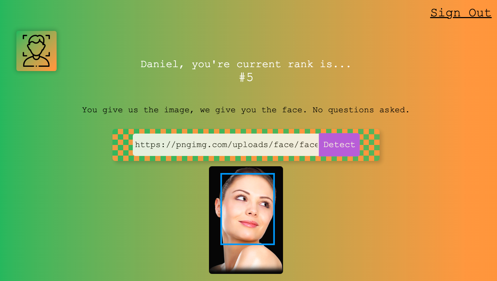

# React - Face recognition application

## Description

This application is built with React. It uses the clarifai face detection API to display 
on the screen a blue box with the dimension of the face in a .png file

The next developments are login, logout and register functionalities, and database implementation with PostgreSQL.

### Images

 

